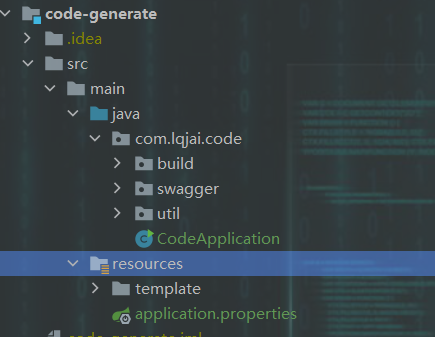

# Web 攻坚， Come On ！

## 开发环境

参考：http://www.oeong.com:8080/ncpsy

swagger文档：http://www.oeong.com:8088/swagger-ui/index.html

ApiPost：https://console-docs.apipost.cn/preview/3079de68fd2a0eca/2da34accb64849e1

## 项目结构

### doc : 文档资料
### code-generate : 代码生成器
代码生成器初始项目结构如下，生成的代码复制到相应模块后及时删除，以免产生干扰文件

### web : 前端项目
### system : 后端项目

