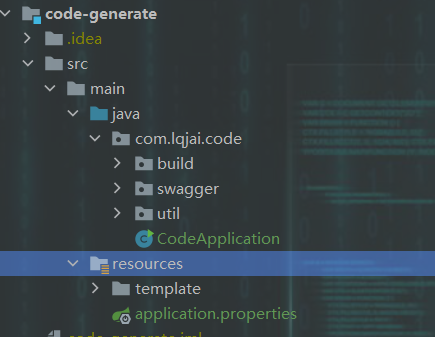

# Web 攻坚， Come On ！

## 项目结构
### doc : 文档资料
### code-generate : 代码生成器
代码生成器初始项目结构如下，生成的代码复制到相应模块后及时删除，以免产生干扰文件

### web : 前端项目
### system : 后端项目

## 其他参考资料

1.其他小组原型图
https://h81en4.axshare.com/#id=iwkae3&p=1_%E4%B8%BB%E9%A1%B5